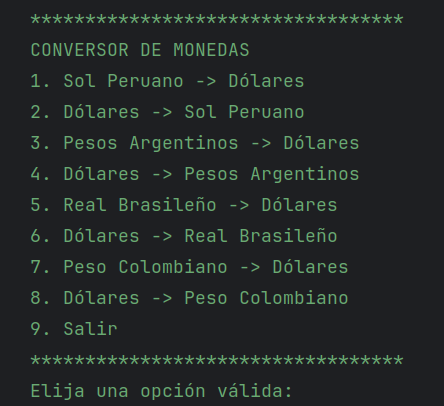

## Descripción del Proyecto

El proyecto es un conversor de monedas desarrollado en Java, que permite a los usuarios convertir entre diferentes tipos de monedas de forma rápida y sencilla. El conversor es capaz de realizar varios Tipos de Cambio entre las monedas Sol del Perú (PEN), Pesos Argentinos (ARS), Real Brasileño(BRL), Peso Colombiano (COP) y el Dólar (USD).

La interfaz del conversor es intuitiva y fácil de usar, lo que permite a los usuarios realizar conversiones en cuestión de segundos. Además, el cuenta con una base de datos actualizada de los tipos de cambio más recientes, lo que garantiza que las conversiones sean precisas y estén al día.

En general, el conversor de monedas es una herramienta útil y práctica para cualquier persona que necesite realizar conversiones de moneda con regularidad. Su interfaz intuitiva y su base de datos actualizada lo convierten en una opción confiable y precisa para los usuarios de todos los niveles de habilidad.

## Funcionalidades del Proyecto

- El convertidor de monedas puede:

> [!Nota] Conversiones
    
1. Sol Peruano -> Dólares
2. Dólares -> Sol Peruano  
3. Pesos Argentinos -> Dólares  
4. Dólares -> Pesos Argentinos  
5. Real Brasileño -> Dólares  
6. Dólares -> Real Brasileño  
7. Peso Colombiano -> Dólares  
8. Dólares -> Peso Colombiano

## Tecnologías utilizadas

-  java 24 2025-03-18
- gson 2.13.1
